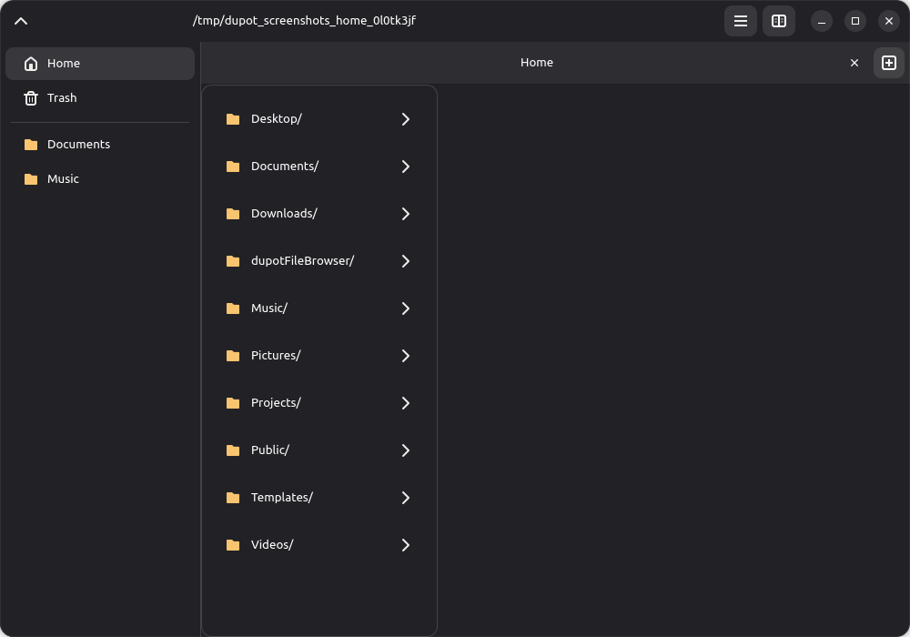
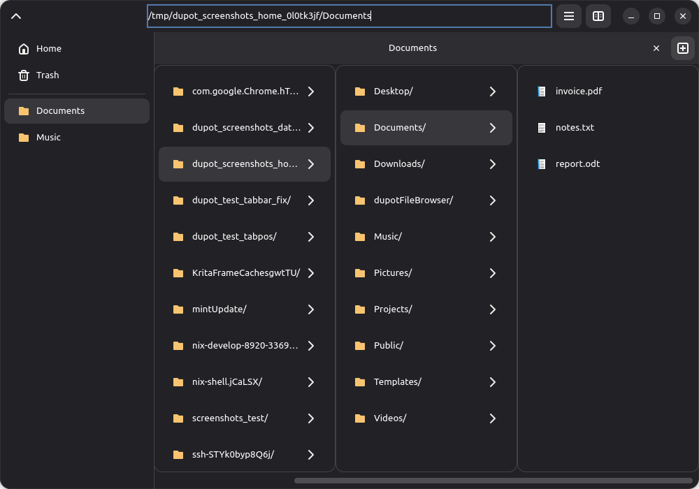
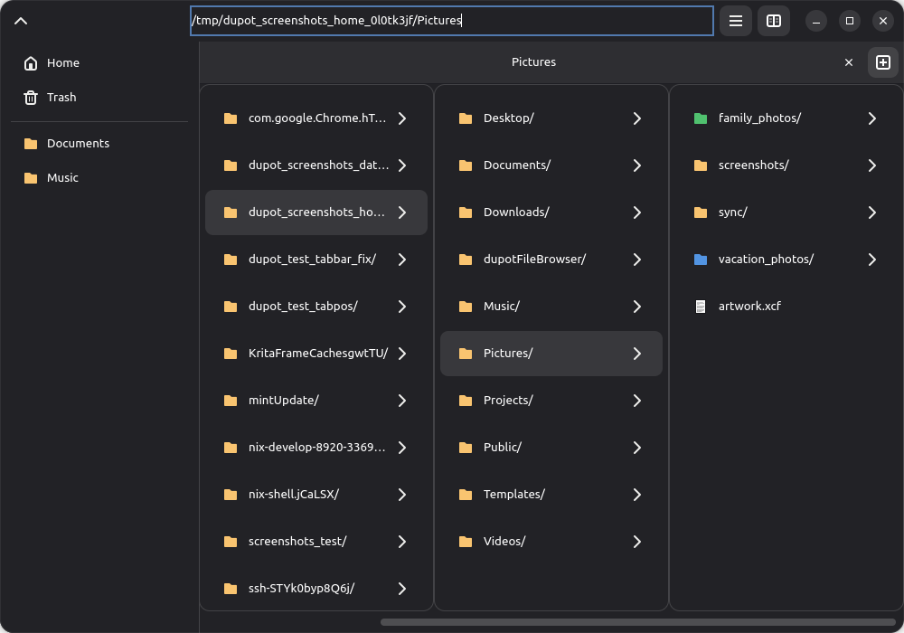
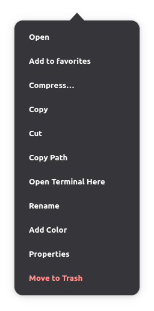
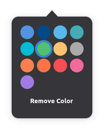
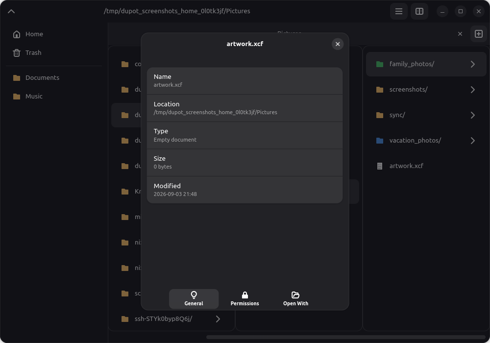
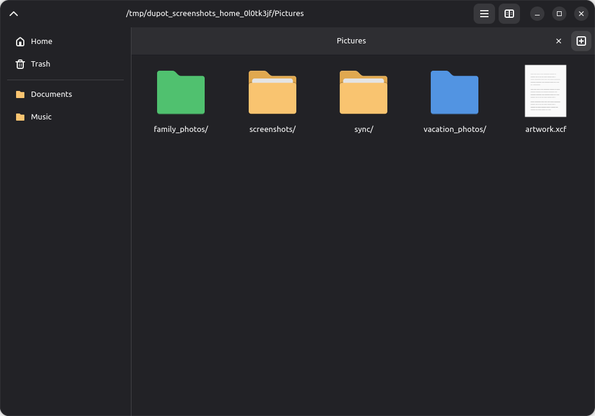
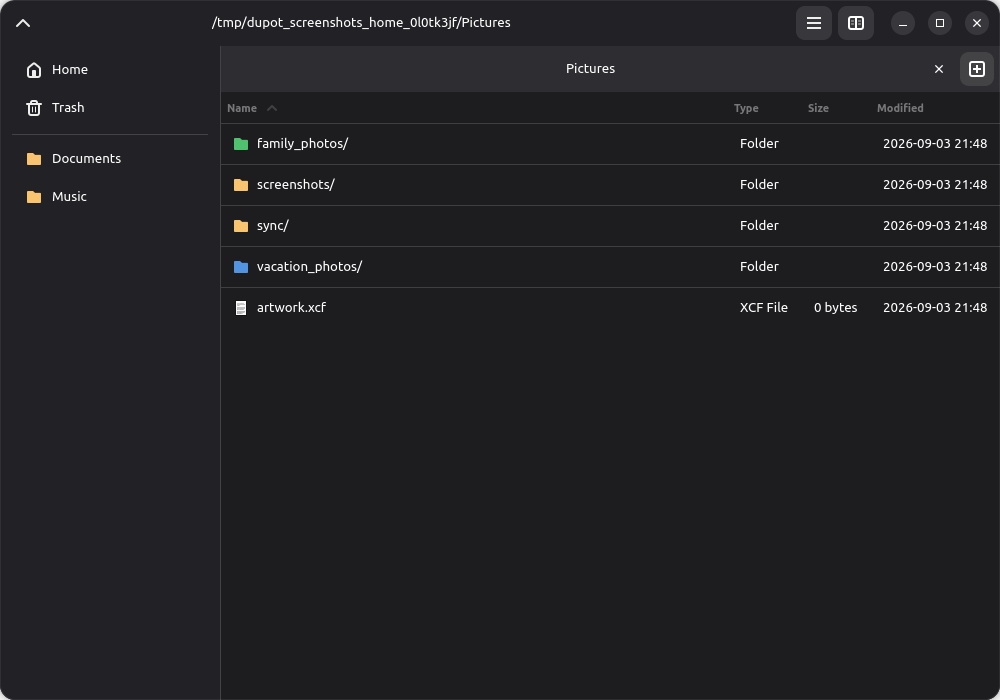
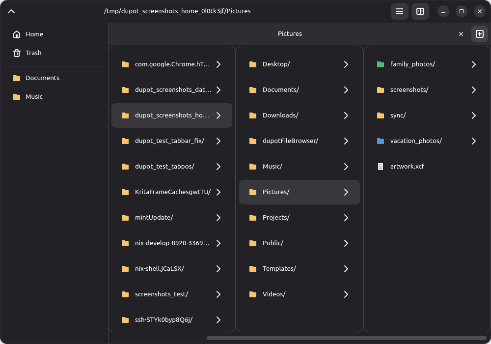
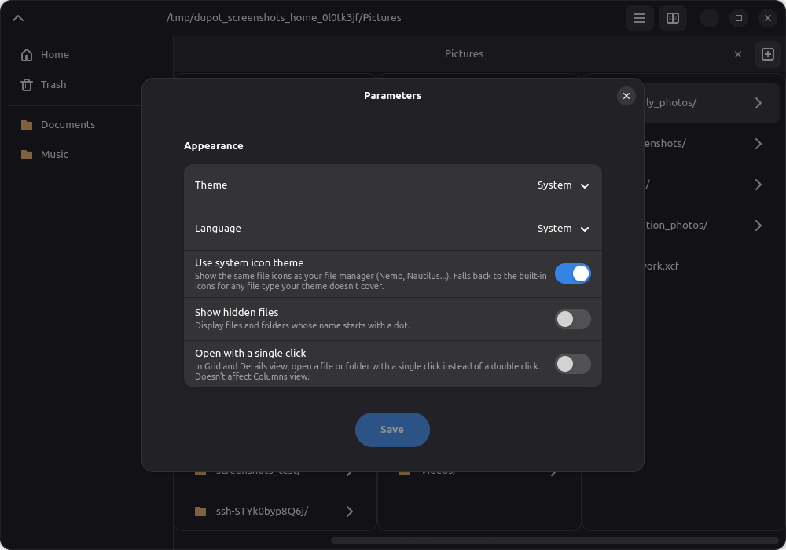

# dupotFileBrowser

A simple, lightweight file browser built with Python, GTK4 and libadwaita.

This is a Python/GTK rewrite of the original Flutter app, following the same
"clean architecture" layout as [dupotEasyFlatpak](https://github.com/imikado/dupotEasyFlatpak)
(`domain/` for entities, use cases and contracts; `infrastructure/` for GTK
UI and system access).

## Features

- Browse your home folder and navigate into subfolders
- Click a folder to open it, click a file to open it with its default app
- Dark/light/system theme, toggleable from the header bar
- Available in English, French and Italian
- Preferences persisted under `$XDG_DATA_HOME/org.dupot.filebrowser/`

## Screenshots

<table>
<tr>
<td><br>Home folder</td>
<td><br>Navigation by column</td>
</tr>
<tr>
<td><br>Path is editable</td>
<td><br>Folder context menu</td>
</tr>
<tr>
<td><br>Tag a folder with a color</td>
<td><br>File properties</td>
</tr>
<tr>
<td><br>Grid view</td>
<td><br>Details view</td>
</tr>
<tr>
<td><br>Columns view</td>
<td><br>Parameters</td>
</tr>
</table>

Regenerated from a demo dataset (not your real files) with:

```sh
./generate_screenshots.py
```

## Project layout

```
src/
  main.py                          entry point, gettext + settings bootstrap
  domain/
    conf/path_conf.py              asset & user-data path resolution
    entity/                        UserSettingsEntity, FileEntryEntity
    contract/                      interfaces implemented by infrastructure/
    UseCase/list_directory_uc.py   list + filter + sort a directory
  infrastructure/
    api/                           SystemApi (filesystem), UserSettingsApi
    ui/                            AppWindow, PathPage, ParametersDialog, sidebar
    locales/                       gettext .po/.mo per language
assets/logos/                      app icon
assets/icons/{light,dark}/         file-type row icons (baked PNGs, not looked up in the host icon theme)
export/flatpak/                    desktop file, appdata.xml, icon set
org.dupot.filebrowser.yml          flatpak-builder manifest
```

## Run locally

This project uses a [Nix flake](flake.nix) to provide GTK4/libadwaita +
PyGObject without touching your system packages:

```sh
nix develop
python src/main.py
```

Without Nix, install GTK4, libadwaita and PyGObject through your distro's
packages (e.g. on Fedora: `sudo dnf install python3-gobject gtk4 libadwaita`)
and just run `python3 src/main.py`.

## Translations

Languages: `en fr it` — `.po` files live in
`src/infrastructure/locales/<lang>/LC_MESSAGES/dupot_file_browser.po`.

After adding new `_("…")` strings in the Python code, run:

```sh
./generate_translations.sh   # extracts strings → .pot, merges into .po, compiles .mo
```

Strings passed as *variables* to `_()` (the theme/language choice labels in
`domain/entity/user_settings_entity.py`) aren't picked up by `xgettext`
automatically — they're listed by hand in
`src/infrastructure/locales/dynamic_hints.pot` and merged in by the script.

## Build the Flatpak

```sh
flatpak-builder --user --install --force-clean build-dir org.dupot.filebrowser.yml
flatpak run org.dupot.filebrowser
```
