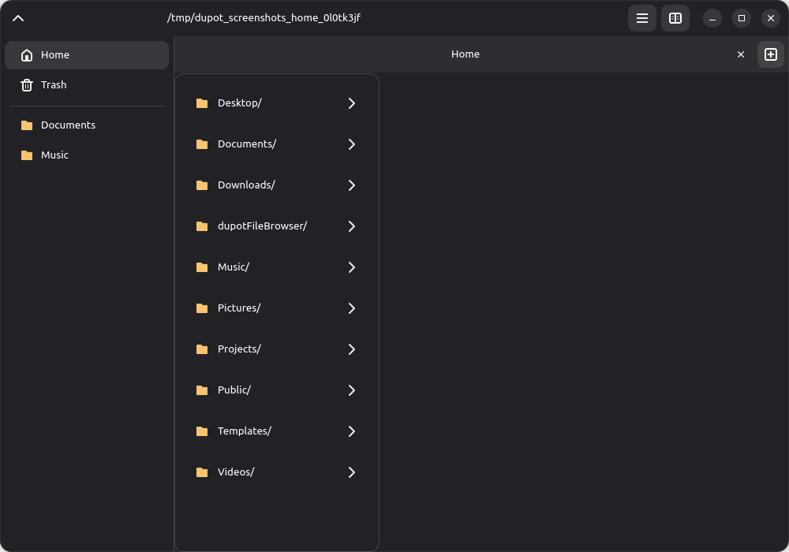
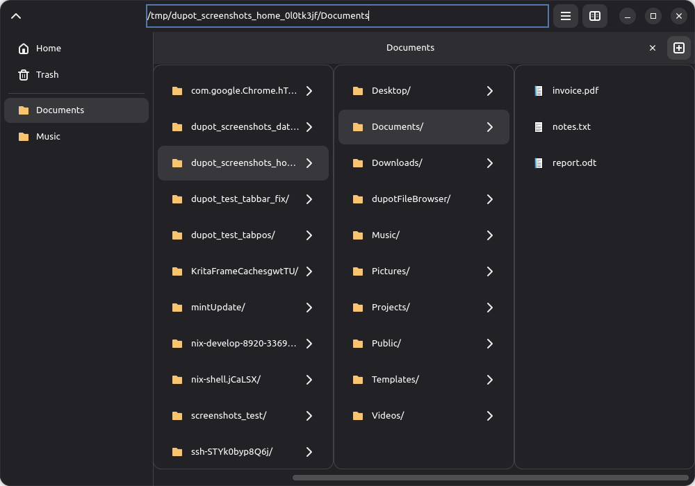
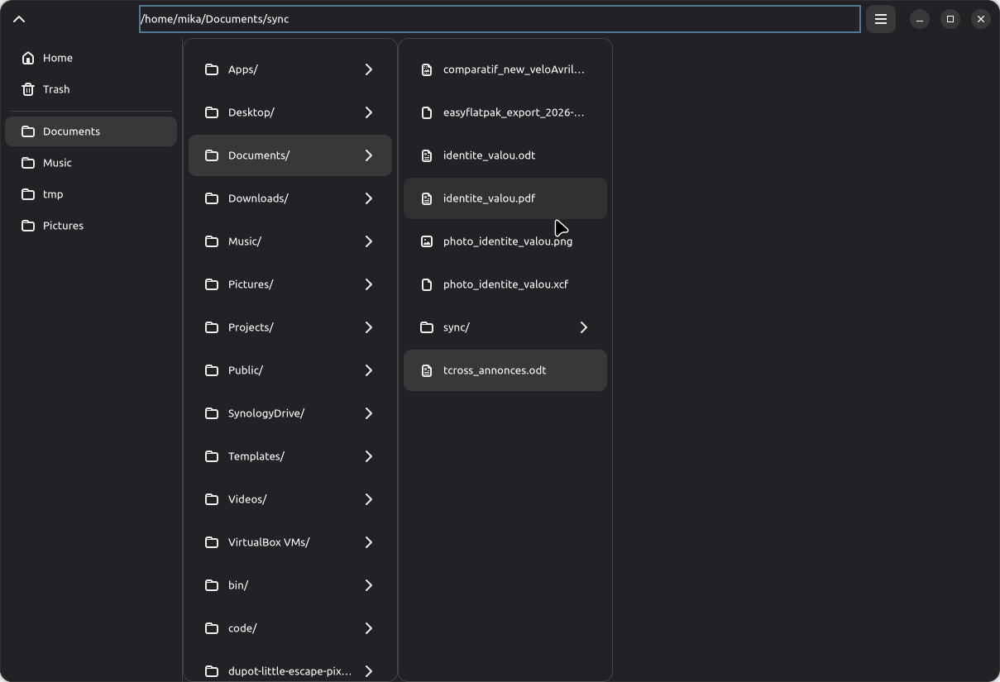
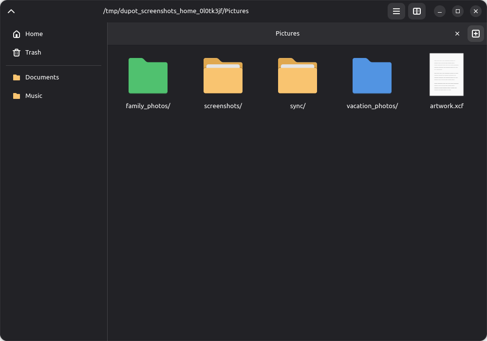
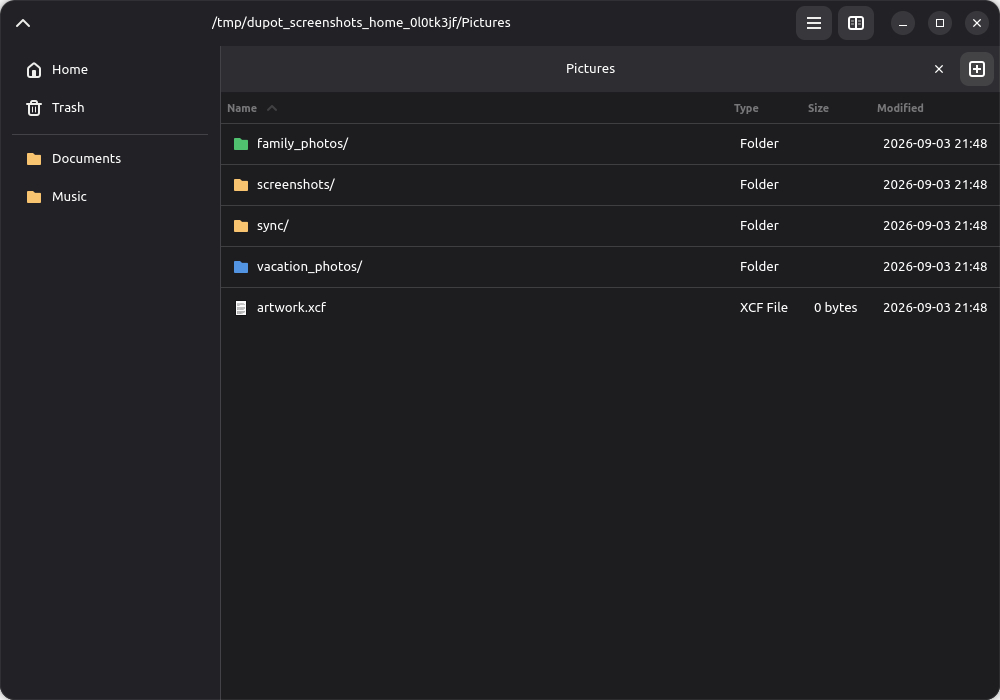
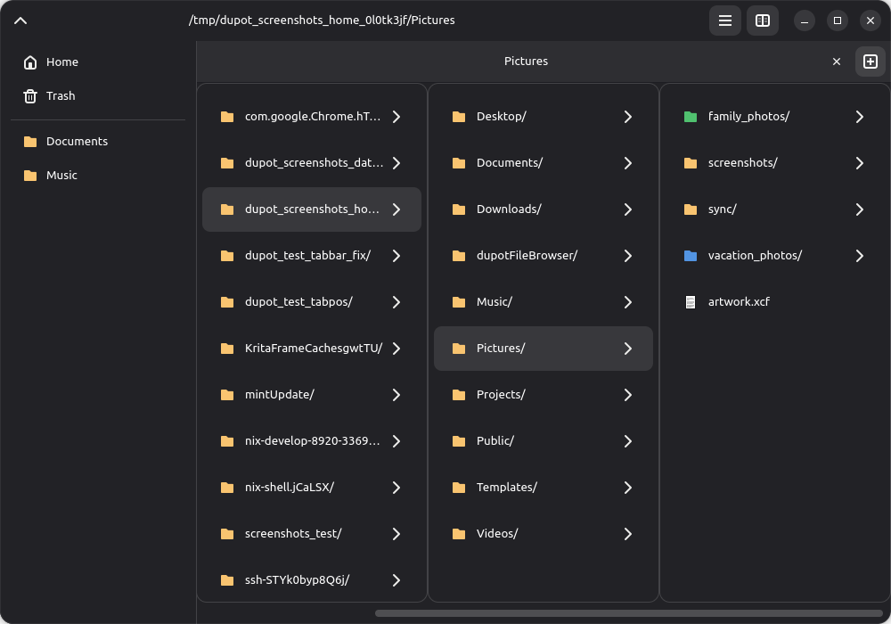
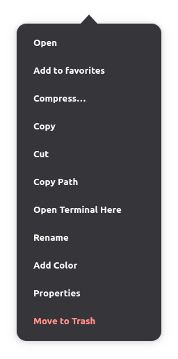
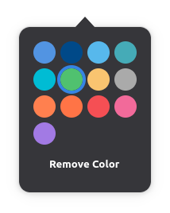
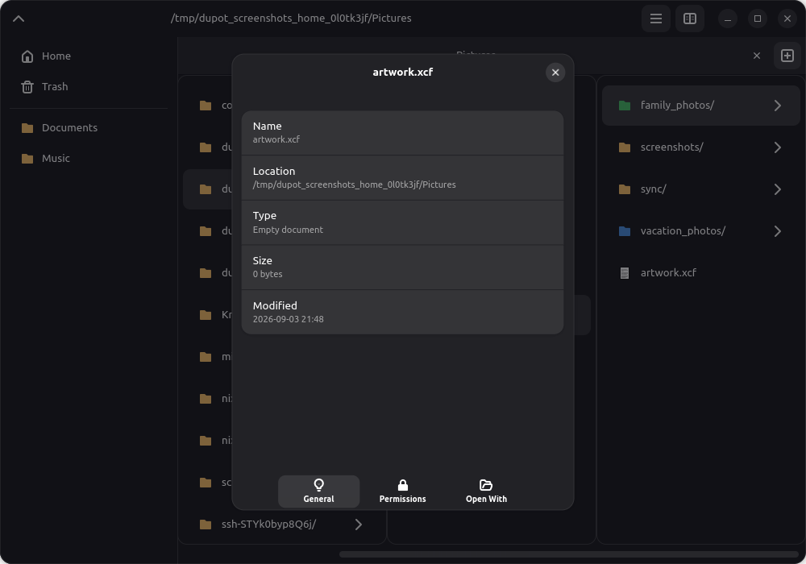
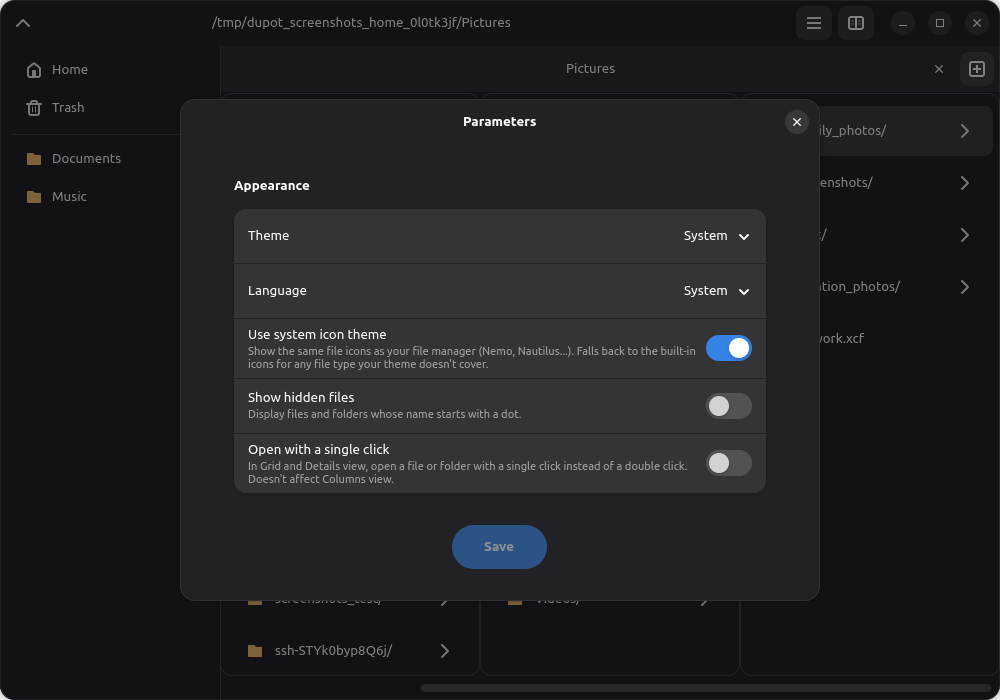

<div align="center">



# dupotFileBrowser

**A simple, lightweight file browser for the Linux desktop.**
Built with Python, GTK4 and libadwaita — clean, fast, and out of your way.


</div>

---

## Why dupotFileBrowser?

Most file managers try to do everything. dupotFileBrowser focuses on what you
do every day — **finding, opening and organizing your files** — with an
uncluttered GNOME-style interface that feels at home on any modern Linux
desktop.

## ✨ Features

### Navigation
- **Three view modes**: Miller **columns** (the default), **grid** with an
  icon-size slider (great for browsing pictures), and a **details** list
- **Tabs** — open several folders side by side (<kbd>Ctrl</kbd>+<kbd>T</kbd> /
  <kbd>Ctrl</kbd>+<kbd>W</kbd>)
- **Editable path bar** — type a path and press <kbd>Enter</kbd> to jump there
- **Sidebar** with Home, Trash, your favorites, and host `/etc` & `/usr`
  shortcuts (handy inside the Flatpak sandbox)
- Optional **single-click** opening and **hidden-files** toggle

### File operations
- Copy, cut / move, paste, rename, and **move to Trash**
- **Trash page** — restore items or delete them permanently, empty the Trash
- **Compress** files and folders to `.zip`, `.tar`, `.tar.gz`, `.tar.bz2`, `.tar.xz`
- **Extract** archives, including `.rar`
- **Open with…** any application, and set the default app for a file type
- **Open a terminal here** and **copy the path** from the context menu

### Organization & info
- **Color-tag folders** to spot them at a glance
- **Add folders to favorites** in the sidebar
- **Properties dialog**: size (computed for folders), type, dates, owner,
  and editable **permissions**
- **Set an image as wallpaper** straight from its properties

### Look & feel
- Light, dark, or system **theme**
- Baked file-type icons, or your **system icon theme**
- Available in 🇬🇧 English, 🇫🇷 French and 🇮🇹 Italian
- Window size, view mode and preferences are remembered
  (stored under `$XDG_DATA_HOME/org.dupot.filebrowser/`)

## 📸 Screenshots

<table>
<tr>
<td><br><sub>Navigation by column</sub></td>
<td><br><sub>Editable path bar</sub></td>
</tr>
<tr>
<td><br><sub>Grid view</sub></td>
<td><br><sub>Details view</sub></td>
</tr>
<tr>
<td><br><sub>Columns view</sub></td>
<td><br><sub>Folder context menu</sub></td>
</tr>
<tr>
<td><br><sub>Tag a folder with a color</sub></td>
<td><br><sub>File properties</sub></td>
</tr>
<tr>
<td colspan="2" align="center"><br><sub>Parameters</sub></td>
</tr>
</table>

## 🚀 Getting started

### Build and install the Flatpak

```sh
flatpak-builder --user --install --force-clean build-dir org.dupot.filebrowser.yml
flatpak run org.dupot.filebrowser
```

Or produce a standalone `.flatpak` bundle to share or install elsewhere:

```sh
./build_flatpak.sh                 # → org.dupot.filebrowser.flatpak
flatpak install --user org.dupot.filebrowser.flatpak
```

### Run from source

With [Nix](flake.nix) (provides GTK4, libadwaita and PyGObject without
touching your system):

```sh
nix develop
python src/main.py
```

Without Nix, install GTK4, libadwaita and PyGObject from your distribution,
e.g. on Fedora:

```sh
sudo dnf install python3-gobject gtk4 libadwaita
python3 src/main.py
```

## 🛠️ Development

### Architecture

The app follows the same clean-architecture layout as
[dupotEasyFlatpak](https://github.com/imikado/dupotEasyFlatpak): the
`domain/` layer holds entities, use cases and contracts; `infrastructure/`
implements them with GTK and system access.

```
src/
  main.py                          entry point, gettext + settings bootstrap
  domain/
    conf/                          paths & app version
    entity/                        user settings, file entry, properties, trash entry
    contract/                      interfaces implemented by infrastructure/
    UseCase/list_directory_uc.py   list + filter + sort a directory
  infrastructure/
    api/                           SystemApi (filesystem, archives, trash…), UserSettingsApi
    ui/                            window, tabs, column/grid/details/trash pages, dialogs
    locales/                       gettext .po/.mo per language
assets/logos/                      app icon
assets/icons/{light,dark}/         baked file-type icons
export/flatpak/                    desktop file, appdata.xml, icon set
org.dupot.filebrowser.yml          flatpak-builder manifest
```

### Translations

Languages: `en`, `fr`, `it` — files live in
`src/infrastructure/locales/<lang>/LC_MESSAGES/dupot_file_browser.po`.

After adding new `_("…")` strings, run:

```sh
./generate_translations.sh   # extract → .pot, merge into .po, compile .mo
```

Strings passed to `_()` as *variables* (theme/language labels in
`domain/entity/user_settings_entity.py`) aren't found by `xgettext`; they're
listed by hand in `src/infrastructure/locales/dynamic_hints.pot` and merged by
the script.

New languages and translation fixes are very welcome!

### Screenshots

Screenshots are generated from a demo dataset (not your real files):

```sh
./generate_screenshots.py
```

### Releasing

`./update_version.py` keeps `src/domain/conf/app_version_conf.py` in sync with
the latest `<release>` in `export/flatpak/org.dupot.filebrowser.appdata.xml`.

## 🤝 Contributing

Bug reports, ideas and pull requests are welcome on
[GitHub](https://github.com/imikado/dupotFileBrowser/issues).

## 📄 License

Released under the [GNU LGPL v2.1](LICENSE).
Made by [Michael Bertocchi](https://www.dupot.org).
